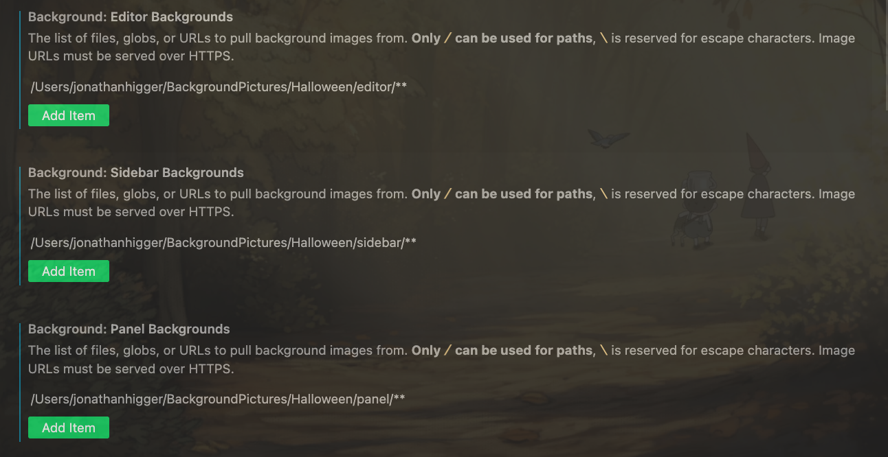

# Background Images

This is just a set of background images for VSCode to be used with the [Katsute Background Plugin](https://marketplace.visualstudio.com/items?itemName=Katsute.code-background).

# Installation

1. Download the plugin
2. Clone this repository in `~`
3. Adjust Background Settings
    Go into settings (UI) and type in "background", you will need to point the background plugin towards a path. For all intensive purposes, we only want to use "editor"("code editor), "sidebar"(file explorer) and "panel"(terminal) settings. Point the folder towards the folder on your computer. For me my settings look like this (unless you change your folder name, you may need  to replace `BackgroundImages` with `background-images-vscode`).
    

4. Run `Background Install`

## Tweaking Settings

**Opacity:**

If you want your pictures to be a bit darker you can mess with the opacity. If you would like to do this just know that **The Higher Your Opacity Is the Darker the Image Becomes**. The reason for this is that the opacity is actually the `UI opacity` aka the foreground opacity. So the higher that opacity is the less background image that you will see.

**Color Theme:**

You can also just change your color theme as you please to make it more aesthetic